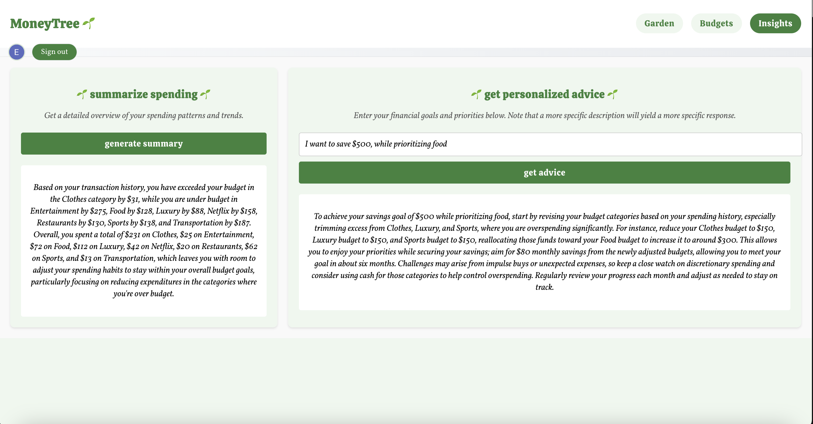

# MoneyTree 🌱

## Contributors

Emma Chen (Brown '27), Erin Kim (Brown '27), Katerina Nguyen (Brown '27), Sophia Li (Brown '27)

## Description

MoneyTree is a visually engaging and intuitive budget management web application that helps users track their expenses in a creative and interactive way. By associating budgets with plants, users can see their financial health grow (or wilt!) over time. Each budget corresponds to a plant, and its state reflects how well the user is managing their spending in relation to their budget. MoneyTree combines visual feedback with practical budgeting tools, offering an immersive experience that gamifies the process of financial responsibility.

## Features

### Design Choices

- Fullstack from React frontend to Java REST backend
  \_ Responsive UI design for mobile and desktop users
- Full test automation: Unit tests, playwright tests, and integrated testing
- ChatGPT integration for spending summaries and personized financial advice

### Garden View

- User authentication via Clerk
- Dynamically renders budgets as alive, wilted, or dead plants
- Interactive modal design for accessible budget updates

### Budget Management View

- Manage financial history by adding new budgets or updating existing ones

### Insights View

- Integration with OpenAI API for personalized spending summaries and advice

## Technology Stack

- Frontend: React, TypeScript
- Backend: Java, Spark Java
- Database: Firebase Firestore
- Authentication: Clerk
- API: OpenAI API

## Install and Run

### Client

Install dependencies

```agsl
cd client
npm install
```

Start the client

```agsl
npm run start
```

Run Playwright tests

```agsl
npm run test
```

### Server

Install dependencies

```agsl
cd server
mvn package
```

Start the server

```agsl
./run
```

Run tests and build

```agsl
mvn package
```

## Application Usage

### Log in or Sign up

- Navigate to the homepage of the website and log in using email.
  

### Access your Garden

- After logging in, you’ll be taken to your personalized garden view.
- Each plant in the garden represents a budget category (e.g., Food, Entertainment, Transportation). The health of the plant (alive, wilting, or dead) corresponds to your spending habits within that category.
- Click on a plant in the garden to open a modal window where you can update or delete the budget for that category.
  
  

### Create and Manage Budgets

- Navigate to the Budgets page to create new budget categories.
- Provide details such as the category name, budget limit, duration, plant type, and any initial spending.
- Submit the form to add a new plant to your garden view.
- Access budget history with options to update or delete individual budgets on this page.
  

### Track Spending

- Your garden dynamically updates as you modify spending amounts or create new budgets.
- The progress bars and plant health visually indicate how well you’re adhering to your budget goals.

### Receive Financial Insights

- Access personalized summaries and advice through integration with OpenAI’s API.
- Navigate to the Insights page to receive tailored spending insights based on your budget data and financial goals.
  

## Citation

OpenAI. (2024). ChatGPT (GPT-4o) [Large language model]. https://chat.openai.com/chat/ We used Blender and ChatGPT to help generate plant images in the alive, wilting, and dead states.
